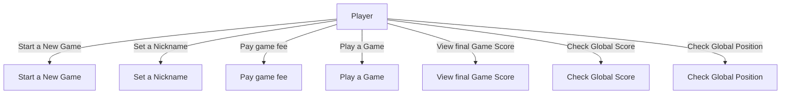
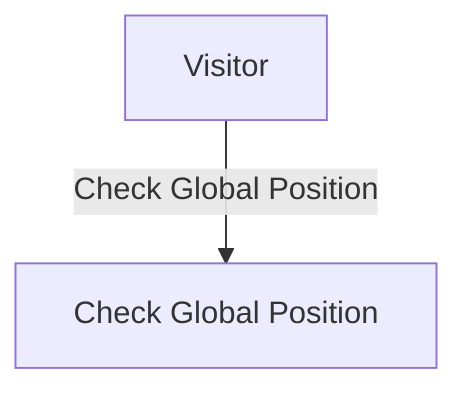
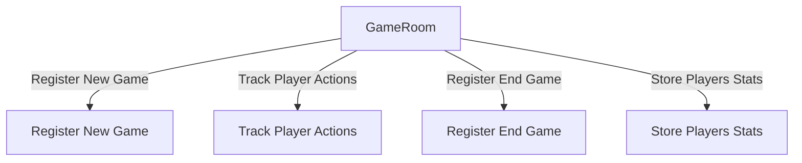
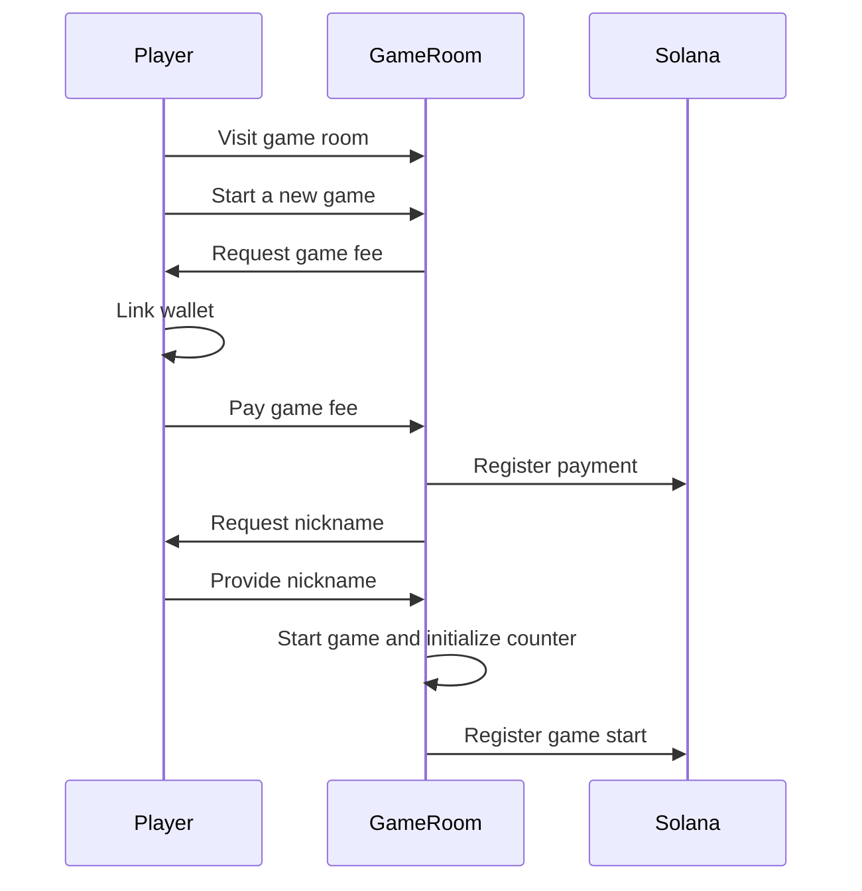
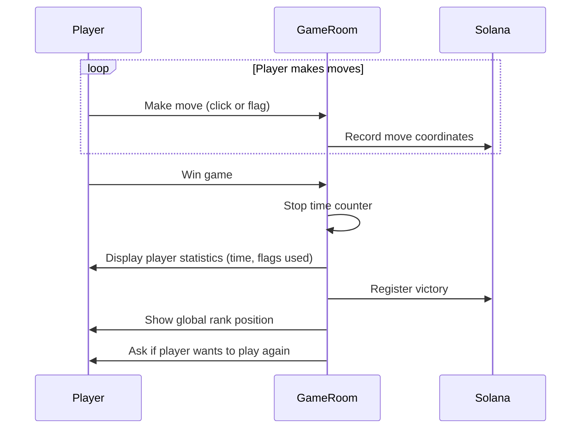
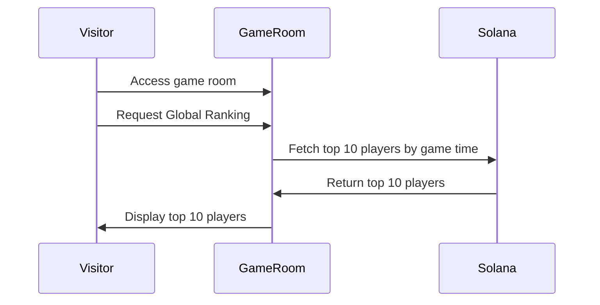

# Solana Minesweeper

Solana Minesweeper brings the classic, beloved Windows Minesweeper into the
future, now powered by Solana blockchain.

Just like the arcade days, players will need to "insert a coin" to begin each match.
Every player’s actions and high scores are securely stored on the blockchain, adding a layer of transparency and
trust.

In the upcoming update, the game will introduce a multiplayer cooperative
mode, allowing players to team up and increase the excitement and interaction.
Get ready for a new era of Minesweeper, where tradition meets cutting-edge
technology!

## Development environment

### Starting local dev-server

1. Checkout the project and go to project root folder
2. install the js dependencies `yarn install`
3. use `yarn dev` to start your dev server.
4. Access http://localhost:5173/ the system should be on.

### Deploying on dev.net

1. Go to anchor folder.
2. Sync your keys using  `anchor keys sync`
3. build the anchor project with: `cargo build-sbf && anchor build`
4. Deploy on devnet with: `anchor deploy --provider.cluster devnet`

## Random Info.

* Test Game
  created: https://explorer.solana.com/tx/23fYNT3gYozsmMpqWFxsqXAVdHyM12BLC231V4Ka3v5UDnzv4ddrJQvsZUg7q2M4P5sWZTFMG2eeU3wi1GNC5x1P?cluster=devnet

## Architecture

### Use cases

Actors:

1. Player
2. Visitor
3. GameRoom

### Use cases: Start a New Game, Pay game fee, Set a Nickname,

### Use cases: Play Game (win output)

### Use cases: Play Game (win/lose output)

### Use cases: Global Ranking

